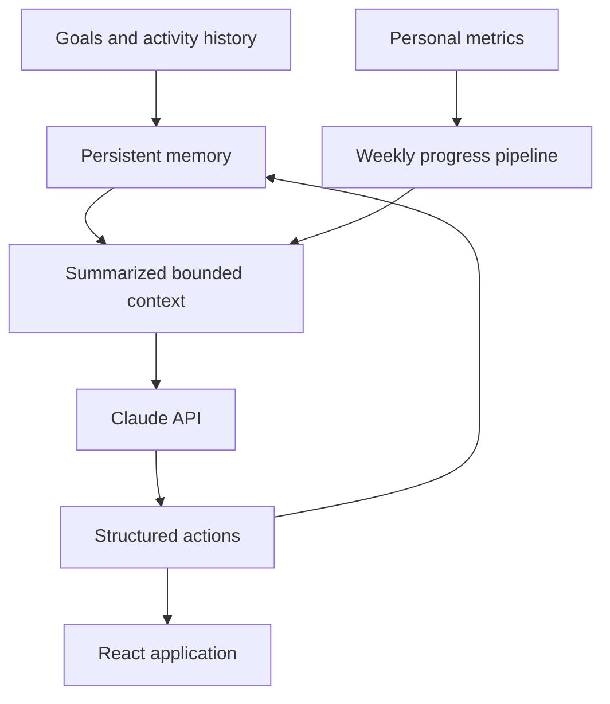

# AI Personal Coaching Agent

**Stateful coaching agent with persistent memory and structured actions**

Personal project developed in Pittsburgh from December 2025 to March 2026.

## Overview

The agent stores and retrieves user context — including goals and activity history — across sessions so it can reason over past data instead of treating each conversation as isolated.

## Core Capabilities

- Maintains a persistent memory layer for user goals and activity history.
- Ingests personal metrics and computes weekly progress.
- Summarizes historical context before sending it to the model, keeping token usage bounded as history grows.
- Produces structured actions including progress summaries, goal adjustments, and pattern alerts.
- Parses and applies those actions programmatically instead of returning only free-text replies.
- Provides a full-stack React application deployed on Vercel.
- Uses the Claude API as the reasoning layer.

## Architecture

## Structured Actions

The application handles three documented action categories:

- Progress summaries
- Goal adjustments
- Pattern alerts

## Technology

- **Application:** Full-stack React
- **Deployment:** Vercel
- **Reasoning layer:** Claude API
- **Data:** Persistent storage and structured personal-metrics pipeline
- **Concepts:** AI agents, persistent memory, bounded context, and structured outputs

## Repository Status

This repository currently presents the project's verified architecture and capabilities. The application source and deployment configuration are being organized for a complete public release.
