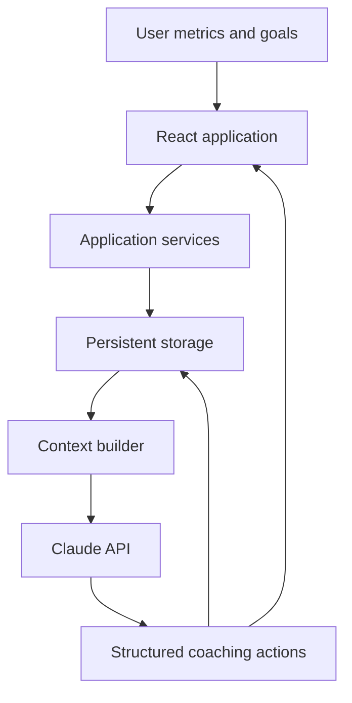

# AI Personal Coaching Agent

**Stateful full-stack coaching application with persistent memory and structured AI actions**

## Overview

Most conversational assistants treat every session as an isolated interaction. This project was built to preserve meaningful user context — including goals, activity history, and progress — so the coaching agent can reason over past data and produce consistent, useful guidance over time.

## Core Capabilities

- Stores and retrieves user goals, activity history, and coaching context across sessions.
- Ingests personal metrics and computes weekly progress summaries.
- Compresses historical data into bounded context so token usage remains controlled as history grows.
- Produces structured actions such as progress summaries, goal adjustments, and pattern alerts.
- Parses and applies model outputs programmatically instead of relying only on free-text responses.
- Provides a full-stack React interface deployed through Vercel.
- Uses the Claude API as the reasoning layer.

## Architecture

## Design Principles

### Persistent, not stateless

The agent retrieves relevant historical context before responding, allowing recommendations to reflect previous goals and activity.

### Structured, not only conversational

Model responses follow defined action formats that the application can validate, parse, and apply.

### Bounded context

Long-term history is summarized before being sent to the model, preventing prompt size from growing without limit.

## Technology

- **Frontend:** React, JavaScript, HTML/CSS
- **Application:** Node.js and structured data pipelines
- **AI:** Claude API
- **Storage:** Persistent user and activity data
- **Deployment:** Vercel
- **Concepts:** AI agents, memory systems, structured outputs, progress analytics

## Repository Status

This repository is the public documentation release of the project. The application source, configuration, and deployment instructions are currently being consolidated for a complete public release.
