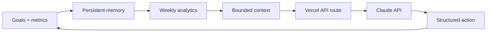

# AI Personal Coaching Agent

**A stateful coaching agent with persistent memory, bounded context, personal metrics, and structured actions.**

This repository contains a functional reconstruction of the personal project developed in Pittsburgh from December 2025 to March 2026. The implementation focuses on the architecture and capabilities documented in the project description without claiming production users or outcomes.

## What it does

- Stores goals, activity metrics, and coaching history across browser sessions
- Computes current-week progress and week-over-week trends
- Builds a bounded context window from summarized goals and recent history
- Sends model requests through a server route so API credentials never reach the browser
- Parses three structured action types: progress summaries, goal adjustments, and pattern alerts
- Falls back to deterministic local coaching when no Anthropic API key is configured
- Provides a responsive React dashboard ready for Vercel

## Architecture



The browser stores the personal memory layer in `localStorage`. Before every coaching request, the application derives weekly analytics and limits context to 12 recent activity entries and eight messages. The server accepts only that compact context and returns one validated action object.

## Structured action contract

```json
{
  "type": "progress_summary | goal_adjustment | pattern_alert",
  "title": "Short action title",
  "message": "Specific coaching response",
  "payload": {}
}
```

## Run locally

```bash
npm install
npm run dev
```

The dashboard works without credentials using the local fallback. To enable Claude reasoning, copy `.env.example` to `.env.local`, add `ANTHROPIC_API_KEY`, and run through the Vercel development environment.

## Verify

```bash
npm test
npm run check
npm run build
```

## Project structure

```text
api/coach.js             Vercel server route and Claude integration
src/App.jsx              Goals, metrics, chat, and structured actions
src/lib/analytics.js     Weekly progress and trend calculations
src/lib/context.js       Bounded-context builder and local fallback
src/lib/memory.js        Persistent browser memory
src/styles.css           Responsive interface
analytics.test.js        Unit tests for weekly progress calculations
context.test.js          Unit tests for bounded-context behavior
```

## Privacy and scope

The MVP stores personal data locally and does not require an account. When Claude is configured, only the bounded context shown by the interface is sent through the server route. This public version is a portfolio reconstruction of the documented project architecture, not a production health or medical service.
